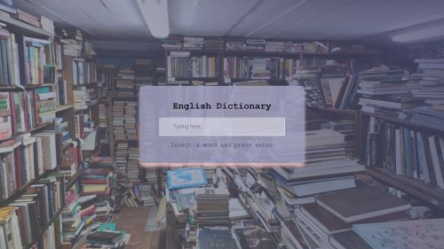

<h1 align="center">English dictionary</h1>

#### What has been implemented:

- used [Free Dictionary API](https://dictionaryapi.dev/) to fetch data from server
- JS allows catch error if a `word` wasn't found `try {} catch()` block
- used `innerHTML` to display the meaning and pronunciation
- if the word isn't found then an error message is displayed
- the dictionary allows to get the meaning of english words and their pronunciation
- handle error if the search word doesn't exist and display information message word `The word was not found`
- if `input` search box is empty then an error message is displayed
- click here to try => <a href="https://bakna2t.github.io/engword/" target="_blank">English Dictionary</a>

---

    

